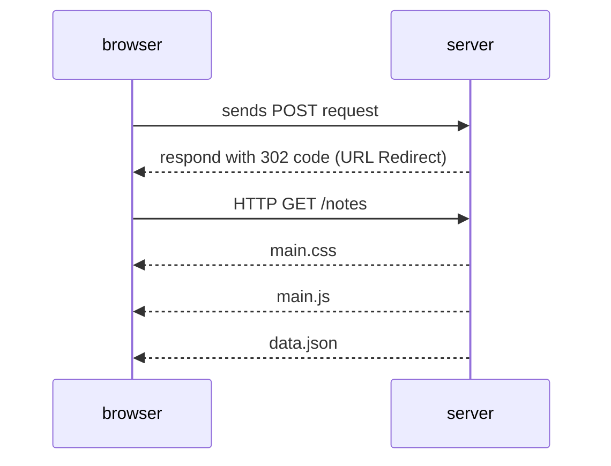

```mermaid
sequenceDiagram
    participant browser
    participant server
    browser->>server: sends POST request
    server-->>browser: respond with 302 code (URL Redirect)
    browser->>server: HTTP GET /notes
    server-->>browser: main.css
    server-->>browser: main.js
    server-->>browser: data.json

```