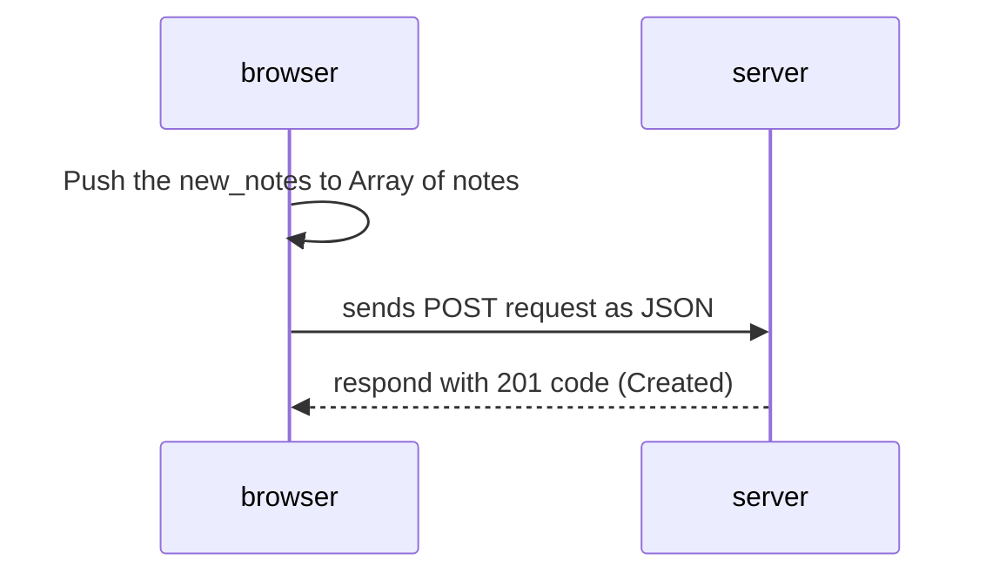

```mermaid
sequenceDiagram
    participant browser
    participant server
    browser->>browser: Push the new_notes to Array of notes
    browser->>server: sends POST request as JSON
    server-->>browser: respond with 201 code (Created)
	
```
